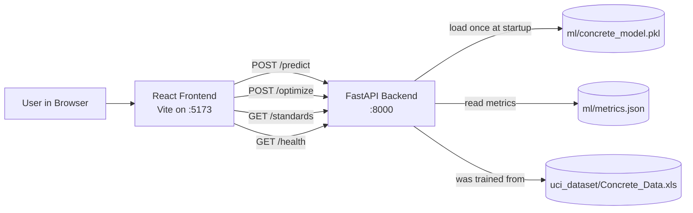
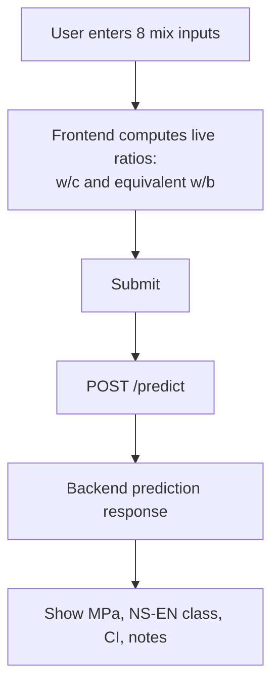
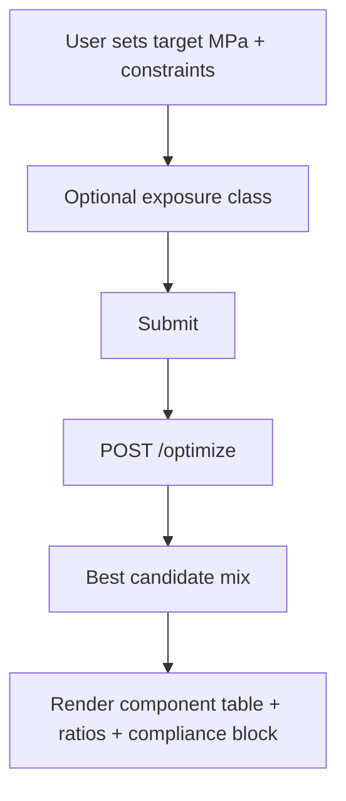
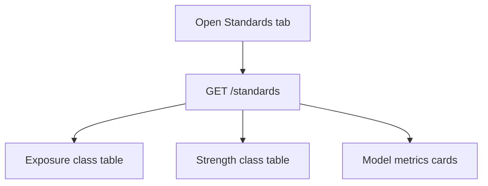
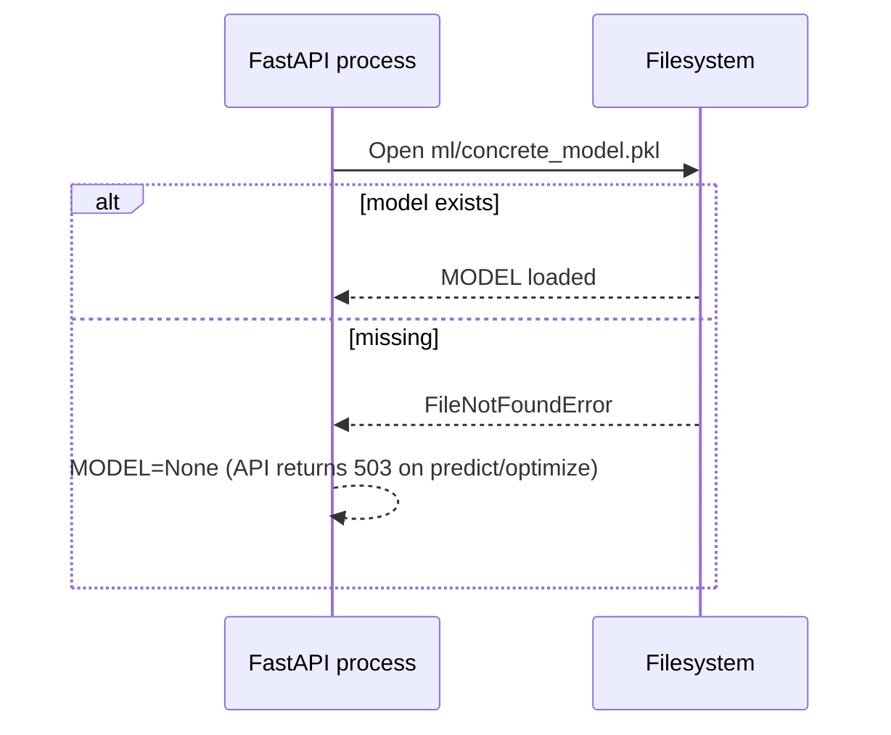
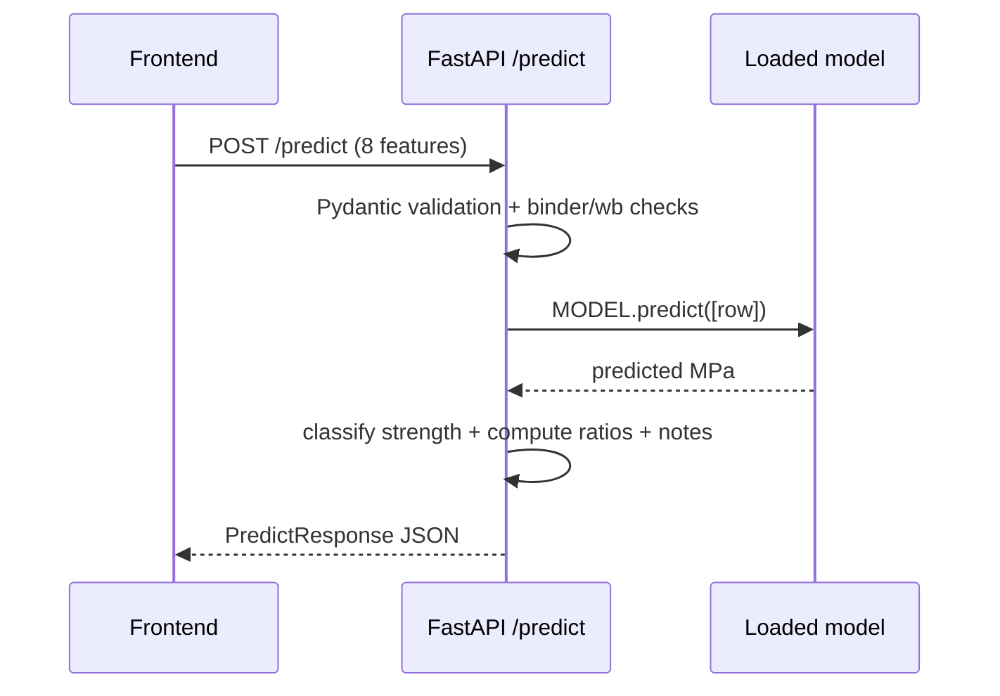
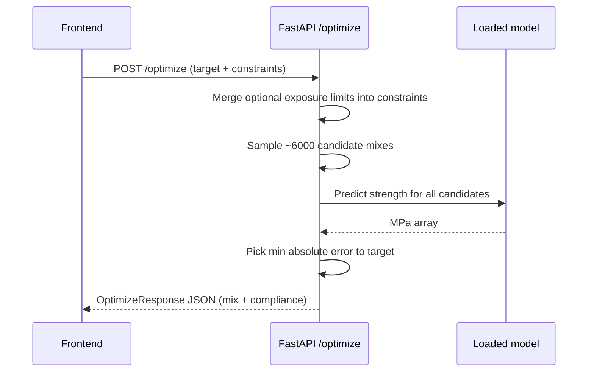

# MixDesign AI - End-to-End Flow (Frontend, Backend, Model, Standards)

This document explains how the app works from UI to ML inference/optimization, how all parts connect, and where Norwegian/NS-EN standards are applied.

## 1) System Architecture



## 2) Runtime Connection Between Frontend and Backend

Frontend talks to relative paths (`/predict`, `/optimize`, `/standards`, `/health`) and Vite proxies them to backend on `http://localhost:8000`.

```mermaid
flowchart TD
    A[Frontend Component] --> B[fetch('/predict' or '/optimize' or '/standards')]
    B --> C[Vite dev proxy]
    C --> D[FastAPI endpoint]
    D --> E[JSON response]
    E --> F[React state update + render cards/tables]
```

- Proxy config is in `frontend/vite.config.ts`.
- UI entry/tabs are in `frontend/src/App.tsx`.
- API types are shared in `frontend/src/types/index.ts`.

## 3) Frontend Flow by Tab

### A. Strength Prediction tab

File: `frontend/src/components/PredictionForm.tsx`



What happens:
- User inputs 8 UCI-aligned features: cement, slag, fly ash, water, superplasticizer, coarse aggregate, fine aggregate, age.
- Frontend locally shows:
  - total binder = cement + slag + fly ash
  - simple `w/c = water / cement`
  - equivalent `w/b = water / (cement + 0.9*slag + 0.4*fly_ash)`
- On submit, it calls `POST /predict` and renders:
  - predicted strength (MPa)
  - NS-EN strength class
  - confidence interval
  - standards notes

### B. Mix Optimisation tab

File: `frontend/src/components/OptimizationForm.tsx`



What happens:
- User chooses target strength, age, SCM toggles (slag/fly ash), optional `min_wc`, `max_wc`, `max_cement`, and optional exposure class (`XC/XD/XS/XF`).
- Backend returns best candidate mix and compliance metadata.
- Frontend shows component quantities, ratio values, and NS-EN compliance block if exposure class used.

### C. NS-EN 206 Reference tab

File: `frontend/src/components/StandardsPanel.tsx`



What happens:
- Reads backend standards dictionary + model metrics from `metrics.json` (if present).
- Renders reference tables for exposure and strength classes.

## 4) Backend Flow

File: `backend/main.py`

### Startup lifecycle



### Request lifecycle for `/predict`



### Request lifecycle for `/optimize`



## 5) ML Model Lifecycle

## Training pipeline

```mermaid
flowchart TD
    X[uci_dataset/Concrete_Data.xls] --> T[ml/train.py]
    T --> P[Preprocess: rename columns]
    P --> SPLIT[Train/Test split]
    SPLIT --> RF[Pipeline(StandardScaler + RandomForestRegressor)]
    RF --> EVAL[MAE, R2, CV MAE]
    EVAL --> PKL[Save ml/concrete_model.pkl]
    EVAL --> JSON[Save ml/metrics.json]
```

Key points:
- `ml/train.py` trains from UCI Excel (`Concrete_Data.xls`) with 8 input features and target compressive strength.
- The backend does not retrain at runtime; it only loads `concrete_model.pkl`.
- Confidence interval in `/predict` is derived from MAE in `metrics.json` (or default 2.0 MPa if metrics missing).

## Important data note

- Runtime inference uses the model from `ml/train.py` (trained on UCI Excel).
- The production runtime model is trained from `uci_dataset/Concrete_Data.xls` and loaded from `ml/concrete_model.pkl`.

## 6) Exactly How Norwegian / NS-EN Standards Are Applied

This section separates **hard constraints in backend logic** from **UI/reference annotations**.

### A. Hard logic enforcement (backend, actual behavior)

In `backend/main.py`:

1. **Equivalent water/binder using k-values**  
   - Uses NS-EN 206 style k-value concept:
   - `w/b_eq = water / (cement + 0.9*slag + 0.4*fly_ash)`
   - Constants:
     - `K_SLAG = 0.9`
     - `K_FLY_ASH = 0.4`

2. **Input practical validity checks (`/predict`)**
   - Pydantic field ranges (cement, water, aggregates, age, etc.).
   - Total binder minimum check.
   - Equivalent w/b practical range check (`0.20-0.90`).

3. **Exposure class constraints in optimization (`/optimize`)**
   - If `exposure_class` provided:
     - backend looks up class in `NS_EN_206_EXPOSURE` map.
     - applies stricter limits:
       - `max_wc` is reduced to class max.
       - `min_cement` is increased to class min.
   - Response includes compliance object with applied limits and required min strength class.

4. **Strength class mapping**
   - Predicted MPa mapped to NS-EN strength class names (`C20/25`, `C25/30`, ...).

### B. Informational standards usage (frontend display / hints)

In `PredictionForm.tsx`, `OptimizationForm.tsx`, `StandardsPanel.tsx`, `App.tsx`:
- Standards references are shown as labels/hints (NS-EN 197-1, 206, 12620, 934-2, 12390-3).
- Tables and text help users interpret results.
- These UI hints do not enforce constraints by themselves; backend logic does.

## 7) End-to-End "Who Does What" Summary

- **Frontend (React/Vite)**  
  Collects user inputs, calls API routes, displays predictions/optimized mix/standards data.

- **Backend (FastAPI)**  
  Validates inputs, computes NS-EN derived ratios, applies exposure constraints, runs model inference, returns decision-ready JSON.

- **Model layer (scikit-learn pipeline)**  
  Random Forest model predicts compressive strength from 8 features; trained offline from UCI dataset and loaded at API startup.

- **Standards layer (embedded dictionaries + formulas)**  
  Encodes exposure class limits, strength classes, and k-value equivalent binder logic used in calculations and constraint handling.

## 8) Practical Startup Dependency

For the full flow to work:
1. `ml/concrete_model.pkl` must exist.
2. If missing, train via `ml/train.py` (which needs `uci_dataset/Concrete_Data.xls`).
3. Then start backend + frontend.

Without model file, `/predict` and `/optimize` return `503`.
